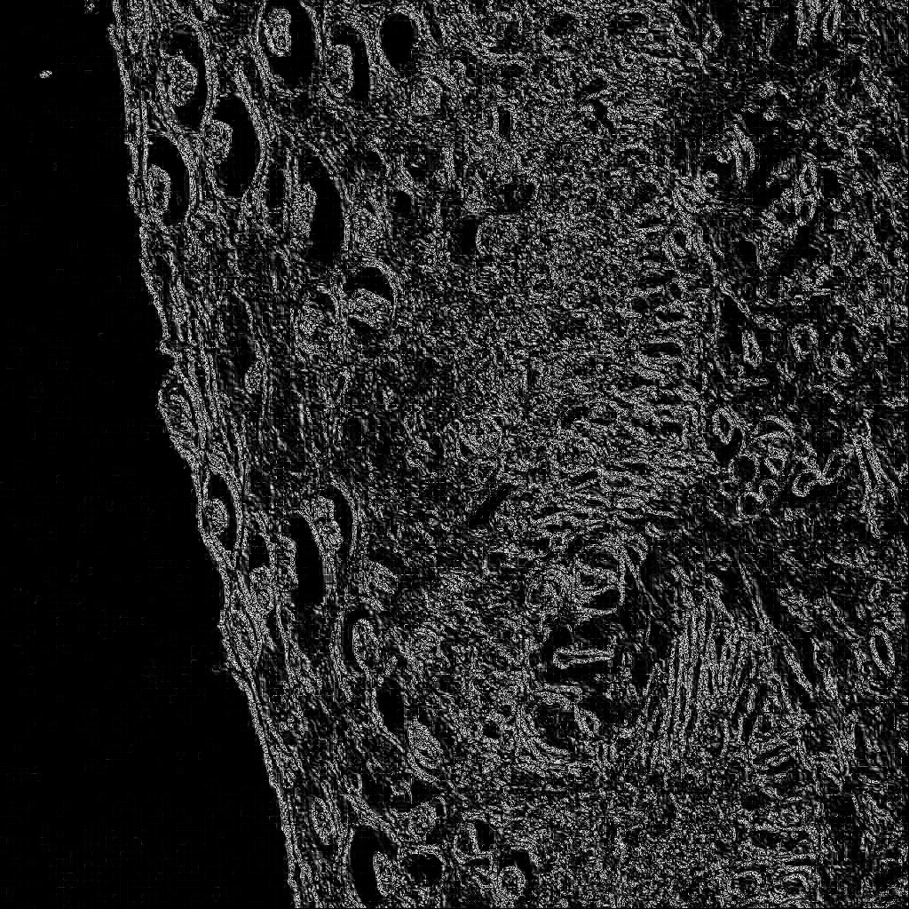
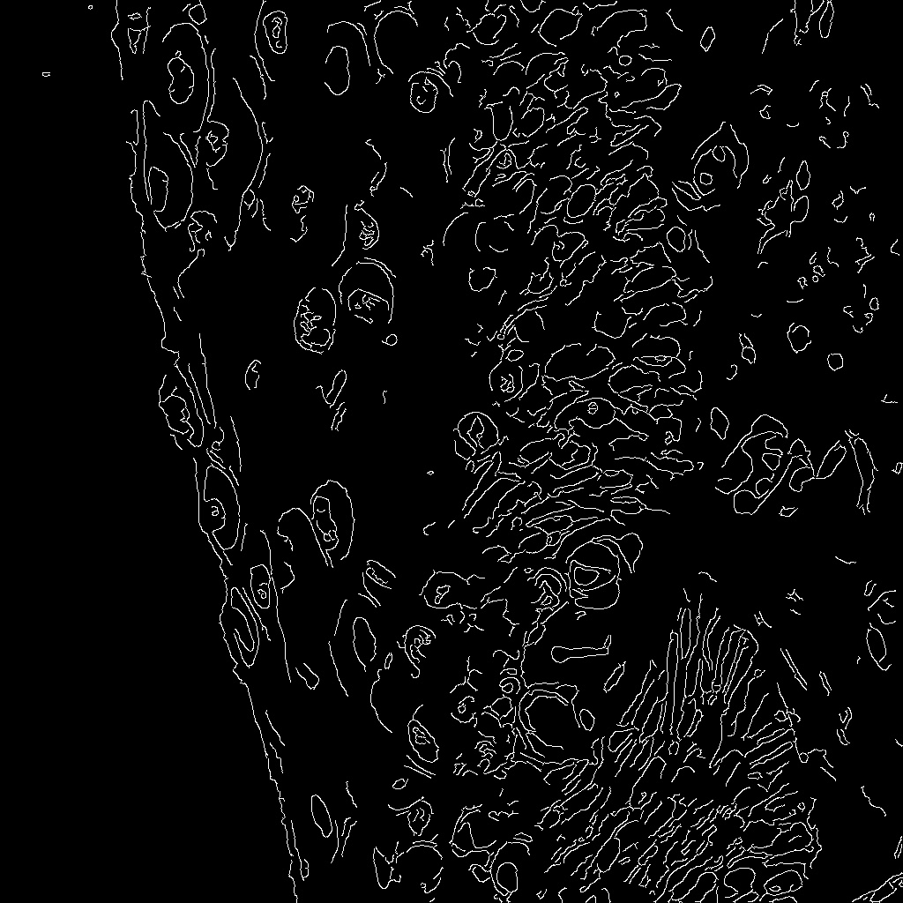
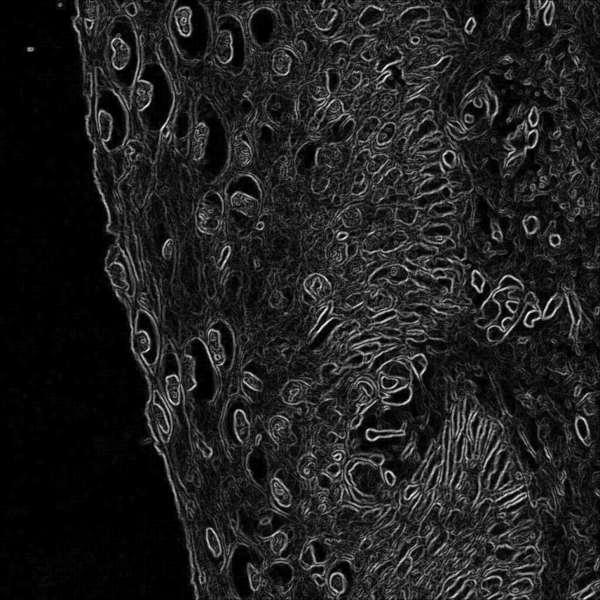
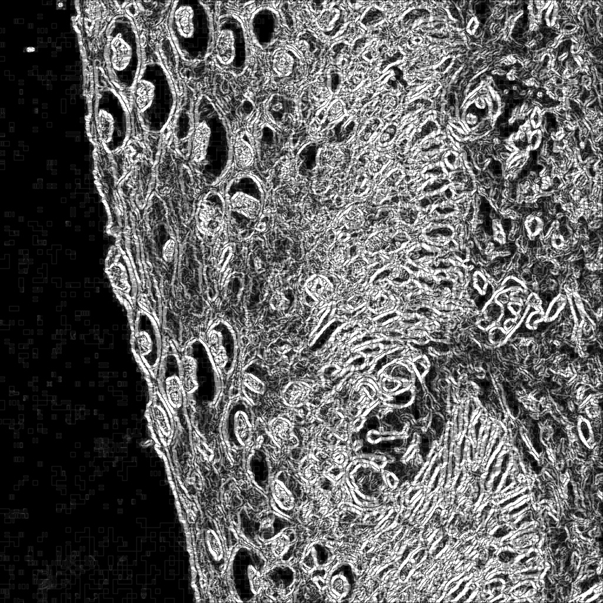

# 科研训练

## 题目

宫颈病理组织图像，如下图，其中分为三层，基底层、中层和上层，需要寻求算法将基底层这条线划出来。


## 分析

首先想到的是图像分割，因每一层组织的特征不同，于此可以进行图像分割算法来进行分层。现已此图为例。

而目标分割为


## 求解

因本人能力有限，于是先从简单的算法到难的算法逐个尝试，看能否解决问题，具体来说首先尝试了下传统的图像处理方法，然后向机器学习迈进。

### 分水岭算法

该算法是一个很好理解的算法，根据分水岭的构成来考虑图形的分割。

其基本思想是将图像看作测地学上的拓朴地貌，图像中每一点像素的灰度值便是该点的海拔高度，每一个局部最小值及其影响区域成为集水盆，而集水盆的边界形成分水岭。

然而该算法会对细微的灰度变化产生过度分割，在细胞组织图像中，细胞核和细胞质形成的细微灰度变化将会对该算法产生很大影响，事实也是如此。

分割结果：


可以看出由于第二层细胞核颜色较深，可以明显看出有图像分割的感觉，但由于细胞质和细胞质灰度值的巨大差异，其并不是连续的一部分。
同时第一层和第三层也没有明显的区分开，因此该算法不能很好解决该问题。

### 基于边缘检测的分割算法

边缘检测算法通过检测不同区域的边缘来解决分割问题。

#### Robert 算子

Robert 算子，又称Roberts边缘检测算子，是一种利用局部差分算子寻找边缘的算子。采用对角线方向相邻两象素之差近似梯度幅值检测边缘,是一个 2x2 的模版，模板分为水平方向和垂直方向。

分割结果：


#### Canny 算子

基于灰度突变来分割图像,实质是提取图像中不连续部分的特征。
分割结果：


#### Sobel 算子



#### Scharr 算子



#### 边缘检测总结

从上述图像可以看出，边缘检测确实可以将图像中的边缘定位，且运行速度很快，但同时它不能保证边缘的连续性，而在细胞组织这种高细节的图像中，其会存在大量的碎边缘(如canny算子中)，让分割后的图像无法观察，但确实能体现出一些不同不同层之间的差别。

### 机器学习方法

## 源码

### 分水岭算法源码

```python
import numpy as np
import cv2
from matplotlib import pyplot as plt
img = cv2.imread("C:\\Users\\Mr_cold\\Desktop\\B001A023C.jpg")
gray = cv2.cvtColor(img,cv2.COLOR_BGR2GRAY)
ret, thresh = cv2.threshold(gray,0,255,cv2.THRESH_BINARY_INV+cv2.THRESH_OTSU)


kernel = np.ones((3,3),np.uint8)
opening = cv2.morphologyEx(thresh,cv2.MORPH_OPEN,kernel, iterations = 2)
# sure background area
sure_bg = cv2.dilate(opening,kernel,iterations=3)#膨胀
# Finding sure foreground area

dist_transform = cv2.distanceTransform(opening,1,5)
ret, sure_fg = cv2.threshold(dist_transform,0.2*dist_transform.max(),255,0)#参数改小了，出现不确定区域
# Finding unknown region
sure_fg = np.uint8(sure_fg)
unknown = cv2.subtract(sure_bg,sure_fg)#减去前景

cv2.imshow('p',sure_fg)
cv2.imwrite("out.jpg",sure_fg)
cv2.waitKey(0)
```

### 边缘检测

#### Canny算子

```py
import numpy as np
import cv2
img = cv2.imread("C:\\Users\\Mr_cold\\Desktop\\B001A023C.jpg", cv2.IMREAD_GRAYSCALE)
gaussian_blur = cv2.GaussianBlur(img, (3, 3), 0)
cv_Canny = cv2.Canny(gaussian_blur, 100, 200)
cv2.imwrite("Canny.jpg",cv_Canny)
```

#### robert算子

```py
import numpy as np
import cv2
def robert(img):
  r, c = img.shape
  new_image = np.zeros((r, c))
  new_imageX = np.zeros((r, c))
  new_imageY = np.zeros((r, c))
  dx = [[-1,0],[0,1]]
  dy = [[0,-1],[1,0]]
  for i in range(r):
    for j in range(c):
      if (j+2<=c) and (i+2<=r):
        new_imageX[i,j] = (np.sum(img[i:i+2, j:j+2] * dx))**2
        new_imageX[i,j] = (np.sum(img[i:i+2, j:j+2] * dy))**2 
        new_image[i,j] = (new_imageX[i, j]*new_imageX[i,j] + new_imageY[i, j]*new_imageY[i,j])**0.5
  return np.uint8(new_image)

# 图像转化成灰度图像
img = cv2.imread("C:\\Users\\Mr_cold\\Desktop\\B001A023C.jpg", cv2.IMREAD_GRAYSCALE)
Roberts = robert(img)
cv2.imwrite("out1.jpg",Roberts)
```

#### scharr算子

```py
import numpy as np
import cv2

img = cv2.imread("C:\\Users\\Mr_cold\\Desktop\\B001A023C.jpg", cv2.IMREAD_GRAYSCALE)
x = cv2.Scharr(img, cv2.CV_16S, 1, 0) # X 方向
y = cv2.Scharr(img, cv2.CV_16S, 0, 1) # Y 方向
absX = cv2.convertScaleAbs(x)
absY = cv2.convertScaleAbs(y)
cv_Scharr = cv2.addWeighted(absX, 0.5, absY, 0.5, 0)
cv2.imwrite("scharr.jpg",cv_Scharr)
```

#### sobel算子

```py
import numpy as np
import cv2

img = cv2.imread("C:\\Users\\Mr_cold\\Desktop\\B001A023C.jpg", cv2.IMREAD_GRAYSCALE)
x = cv2.Sobel(img, cv2.CV_16S, 1, 0)
y = cv2.Sobel(img, cv2.CV_16S, 0, 1)
# 转 uint8 ,图像融合
absX = cv2.convertScaleAbs(x)
absY = cv2.convertScaleAbs(y)
cv_Sobel = cv2.addWeighted(absX, 0.5, absY, 0.5, 0)
cv2.imwrite("sobel.jpg",cv_Sobel)
```